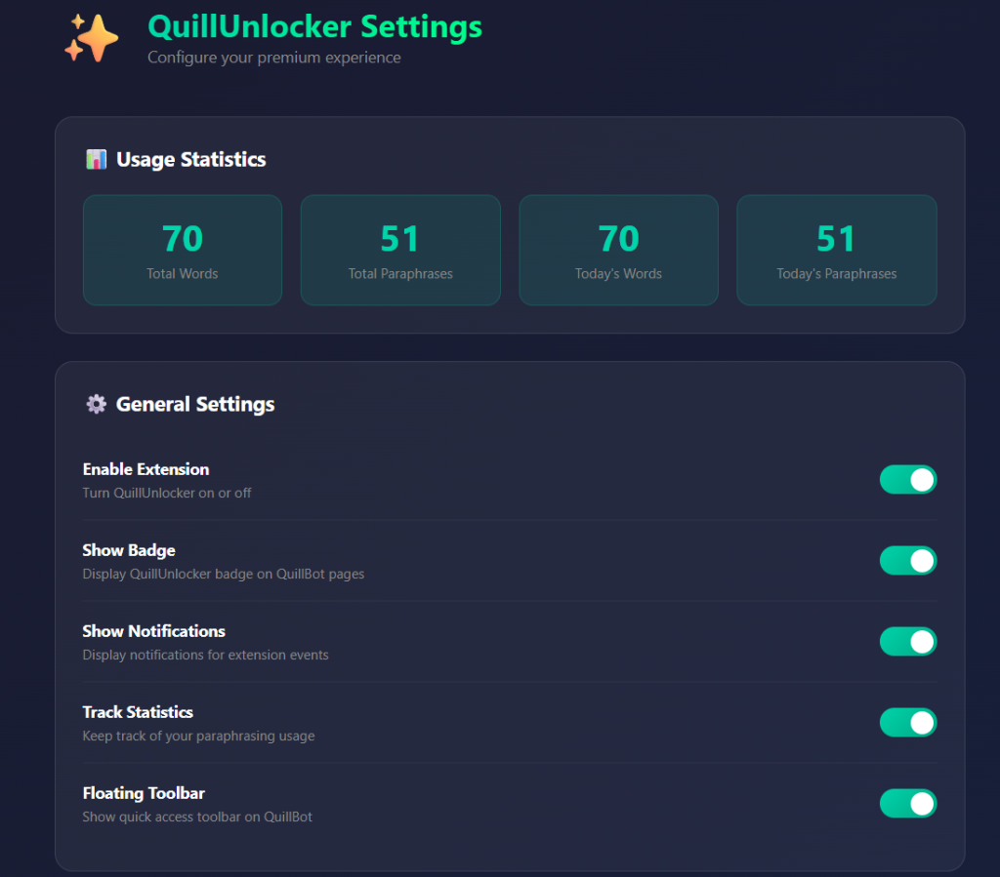

# ✨ QuillUnlocker

<div align="center">



**Ultimate QuillBot Premium Unlocker - All features, no limits**

[](https://github.com/sponsors/ThanhNguyxn)
[](https://buymeacoffee.com/thanhnguyxn)

[](LICENSE)
[](manifest.json)
[](https://developer.chrome.com/docs/extensions/)

</div>

---

## 📖 Table of Contents

- [Features](#-features)
- [Installation](#-installation)
- [Usage](#-usage)
- [Keyboard Shortcuts](#-keyboard-shortcuts)
- [Project Structure](#-project-structure)
- [How It Works](#-how-it-works)
- [Contributing](#-contributing)
- [Support](#-support)
- [Disclaimer](#-disclaimer)
- [License](#-license)

---

## 🚀 Features

### Premium Unlocks

| Feature | Free | With QuillUnlocker |
|---------|:----:|:------------------:|
| Writing Modes | Standard only | All 7 modes ✅ |
| Word Limit | 125 words | Unlimited ✅ |
| Synonym Slider | 2 levels | 4 levels ✅ |
| Summarizer | 1,200 chars | Extended ✅ |
| Freeze Words | ❌ | ✅ |
| Compare Modes | ❌ | ✅ |

### Extension Features

| Feature | Description |
|---------|-------------|
| 🎯 **Context Menu** | Right-click any selected text to paraphrase |
| ⌨️ **Keyboard Shortcuts** | Quick actions at your fingertips |
| 📊 **Statistics Dashboard** | Track your paraphrasing usage |
| ⚙️ **Settings Page** | Customize your experience |
| 🔔 **Notifications** | Stay informed about extension status |
| 🛠️ **Floating Toolbar** | Quick access buttons on QuillBot pages |

---

## 📦 Installation

### Method 1: Manual Installation (Recommended)

1. **Download** this repository:
   - Click the green **Code** button → **Download ZIP**
   - Or clone: `git clone https://github.com/ThanhNguyxn/QuillUnlocker.git`

2. **Open Chrome Extensions**:
   - Navigate to `chrome://extensions/`
   - Or Menu → More Tools → Extensions

3. **Enable Developer Mode**:
   - Toggle the switch in the top right corner

4. **Load the Extension**:
   - Click **Load unpacked**
   - Select the `QuillUnlocker` folder

5. **Done!** Visit [quillbot.com](https://quillbot.com) and enjoy premium features

### Method 2: From Release (Easier)

1. **Download** the latest release:
   - Go to [Releases](https://github.com/ThanhNguyxn/QuillUnlocker/releases)
   - Download the `QuillUnlocker-v1.0.0.zip` file
   - Extract the zip file to a folder named `QuillUnlocker`

2. **Open Chrome Extensions**:
   - Type `chrome://extensions/` in your address bar
   - Or go to Menu (⋮) → Extensions → Manage Extensions

3. **Enable Developer Mode**:
   - Toggle the switch in the top right corner of the Extensions page

4. **Install**:
   - Click **Load unpacked** button
   - Select the extracted `QuillUnlocker` folder
   - **Done!** The extension is now active

---

## 🎮 Usage

### Basic Usage
1. Install the extension
2. Go to [quillbot.com](https://quillbot.com)
3. You'll see the **QuillUnlocker** badge at the bottom right
4. All premium features are now unlocked!

### Context Menu
1. Select any text on any webpage
2. Right-click → **QuillUnlocker** → Choose paraphrase mode
3. Opens QuillBot with your selected text

### Floating Toolbar
1. Hover over the QuillUnlocker badge on QuillBot
2. Quick access buttons appear:
   - 📝 Paraphrase
   - 📊 Summarize
   - ✓ Grammar
   - ⚙️ Settings
   - 💖 Support

### Settings Page
- Right-click extension icon → **Options**
- Or click ⚙️ in the popup
- Customize: badge visibility, notifications, stats tracking, etc.

---

## ⌨️ Keyboard Shortcuts

| Shortcut | Action |
|----------|--------|
| `Alt + Q` | Open QuillUnlocker popup |
| `Ctrl + Shift + P` | Quick paraphrase selected text |
| `Ctrl + Shift + Q` | Toggle extension on/off |

> **Tip:** Customize shortcuts at `chrome://extensions/shortcuts`

---

## 📁 Project Structure

```
QuillUnlocker/
├── 📄 manifest.json        # Extension configuration (MV3)
├── 📄 README.md            # This file
├── 📄 LICENSE              # MIT License
├── 📄 .gitignore           # Git ignore rules
│
├── 📁 icons/               # Extension icons
│   ├── icon16.png
│   ├── icon48.png
│   └── icon128.png
│
├── 📁 src/                 # Source files
│   ├── inject.js           # Content script loader
│   ├── background.js       # Service worker (context menu, shortcuts)
│   └── unlock.js           # Core unlock logic + floating toolbar
│
├── 📁 popup/               # Popup UI
│   ├── popup.html          # Main popup with stats
│   ├── popup.css           # Popup styling
│   ├── popup.js            # Popup logic
│   └── welcome.html        # First-install welcome page
│
└── 📁 options/             # Settings page
    ├── options.html        # Settings UI + stats dashboard
    └── options.js          # Settings logic
```

---

## 🔧 How It Works

QuillUnlocker uses **API interception** to enable premium features:

1. **Account Override**: Intercepts `/get-account-details` API → Sets `premium = true`
2. **Cookie Mocking**: Sets premium cookies for client-side checks
3. **Tracking Block**: Blocks `/api/tracking` requests → Improves privacy
4. **Mode Enable**: Unlocks UI for all writing modes

> **Note**: Some advanced modes (Formal, Creative, Expand, Shorten) may require server-side verification which cannot be bypassed without a valid token. However, unlimited words, standard premium features, and UI unlocks are fully functional.

### Research-Based Implementation

This extension is based on research from:
- [blueagler/QuillBot-Helper](https://github.com/blueagler/QuillBot-Helper) - XHR proxy pattern
- [Ragug/quillbot-premium-for-free](https://github.com/Ragug/quillbot-premium-for-free) - Simple injection
- GreasyFork userscripts - API endpoint patterns

---

## 🤝 Contributing

Contributions are welcome! Please:

1. Fork the repository
2. Create a feature branch: `git checkout -b feature/amazing-feature`
3. Commit changes: `git commit -m 'Add amazing feature'`
4. Push to branch: `git push origin feature/amazing-feature`
5. Open a Pull Request

See [CONTRIBUTING.md](CONTRIBUTING.md) for detailed guidelines.

---

## 💖 Support

If you find QuillUnlocker useful, please consider supporting:

<div align="center">

[](https://github.com/sponsors/ThanhNguyxn)

[](https://buymeacoffee.com/thanhnguyxn)

</div>

Your support helps maintain and improve this project! ❤️

---

## ⚠️ Disclaimer

> **This extension is for educational purposes only.**
>
> - Using this extension may violate QuillBot's Terms of Service
> - The developers are not responsible for any consequences
> - Some features requiring server-side validation may not work
> - Use at your own risk

---

## 📄 License

This project is licensed under the MIT License - see the [LICENSE](LICENSE) file for details.

---

<div align="center">

**Made with ❤️ by [ThanhNguyxn](https://github.com/ThanhNguyxn)**

⭐ Star this repo if you find it useful!

</div>
